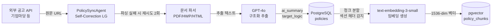
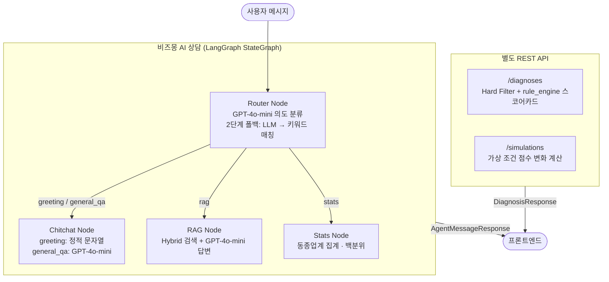
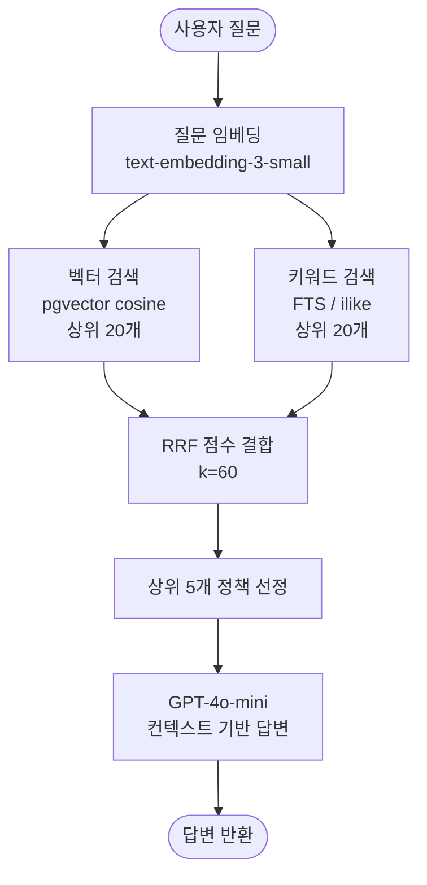

# Biz-Up — 소상공인 경영 합리화 AI 플랫폼

> **"사장님의 정보를 가치로, 정책자금을 성장의 기회로"**  
> 복잡한 행정 용어와 정보 격차를 해소하고, 소상공인의 지속 가능한 성장을 돕는 맞춤형 AI 컨설팅 플랫폼

[](https://www.python.org/)
[](https://fastapi.tiangolo.com/)
[](https://langchain-ai.github.io/langgraph/)
[](https://github.com/pgvector/pgvector)
[](https://openai.com/)

---

## 왜 Biz-Up인가

매년 **20조 원 이상의 정책자금**이 소상공인을 기다리지만, 대부분의 사장님은 복잡한 공고 요건과 정보 비대칭으로 인해 혜택을 받지 못합니다. Biz-Up은 이 문제를 **4가지 핵심 기능**으로 해결합니다.

---

## 핵심 기능 (Key Features)

### 1. 비즈몽 AI 상담 — LangGraph 기반 멀티 에이전트

사장님의 질문 의도를 실시간으로 분류하고, 전문 노드로 라우팅하는 **LangGraph StateGraph** 기반 AI 상담 에이전트입니다.

| 라우팅 의도             | 트리거 예시                          | 처리 노드                                |
| :---------------------- | :----------------------------------- | :--------------------------------------- |
| `greeting / general_qa` | "안녕하세요" / "운전자금이 뭐야?"    | Chitchat Node — 인사 응답 또는 용어 설명 |
| `rag`                   | "청년창업패키지 신청 조건이 뭔가요?" | RAG Node — Hybrid 정책 문서 검색         |
| `stats`                 | "같은 업종 평균 매출은?"             | Stats Node — DB 집계 → 백분위 비교       |

> **진단(Diagnosis)·시뮬레이션(Simulation)** 은 LangGraph 노드가 아닌 별도 REST API(`/diagnoses`, `/simulations`)로 구현되어 있습니다.

### 2. 정책 진단 및 시뮬레이션 — 가중치 기반 스코어카드

사업장 데이터를 기반으로 신청 가능한 정책자금을 자동 진단하고, 가상 조건 변경 시 점수 변화를 시뮬레이션합니다.

```
최종 점수 = 재무건전성×0.40 + 성장잠재력×0.20 + 운영안정성×0.25 + 리스크관리×0.15

신호등 판정:
  RED    → 체납 이력 OR 부채비율 ≥ 300%
  YELLOW → 총점 < 60 OR 부채비율 ≥ 100%
  GREEN  → 그 외
```

- **Hard Filter**: DB 쿼리로 지역·업종·모집상태 조건에 맞지 않는 정책 사전 제거
- **시뮬레이션**: "직원 1명 채용 시", "특허 취득 시" 변화하는 점수와 이자 절감액 계산

### 3. 비즈-픽 (Biz-Pick) — 맞춤형 정책 카드 뉴스

복잡한 공고문을 사장님 눈높이에 맞게 AI가 재가공한 **큐레이션 카드 뉴스** 피드입니다.

- 매일 신규 정책 공고를 수집하여 **GPT-4o가 3줄 요약** 생성
- 사용자 업종·지역 기반 **개인화 우선순위** 배치
- 관심 공고 **북마크** 및 마감 임박 알림 연동

### 4. 통합 대시보드 — 경영 현황 한눈에

- **신청·관심 이력 관리**: 현재 진행 중인 지원 사업의 단계(접수/심사/선정) 트래킹
- **진단 히스토리**: 과거 진단 결과 타임라인으로 경영 지표 변화 추적
- **서류 보관함**: 사업자등록증 등 필수 서류 업로드 → OCR 자동 분석 및 재활용

---

## AI 핵심 기술

### 비용 최적화 — 작업 복잡도별 모델 분리로 채팅 비용 약 15배 절감

"모든 노드에 같은 모델을 쓴다"는 초기 설계에서 벗어나, 각 노드가 실제로 필요로 하는 복잡도를 분석해 모델을 재배정했습니다.

| 노드 / 작업        | 이전   | 이후            | 판단 근거                                        |
| :----------------- | :----- | :-------------- | :----------------------------------------------- |
| Router 의도 분류   | gpt-4o | **gpt-4o-mini** | 4개 레이블 택1, 고성능 추론 불필요               |
| Greeting 인사 응답 | gpt-4o | **정적 문자열** | 응답 패턴 고정, LLM 호출 자체가 낭비             |
| RAG 답변 생성      | gpt-4o | **gpt-4o-mini** | 검색된 청크 정리, 창의적 추론 불필요             |
| PolicySync 구조화  | gpt-4o | **gpt-4o 유지** | 비정형 공고문 → JSON 추출 정확도가 비용보다 우선 |

품질 검증: 모델 변경 후 평가 하네스(12케이스) 재실행 → **83.3% 통과율 유지** 확인.

### 검색 정확도 — Hybrid RAG (pgvector + FTS + RRF)

벡터 검색(의미적 유사도)과 키워드 검색(FTS)을 **Reciprocal Rank Fusion(k=60)** 으로 결합합니다.

| 방식                 | 강점                          | 약점                        |
| :------------------- | :---------------------------- | :-------------------------- |
| 벡터 검색 (pgvector) | 의미적 유사도, 유사 표현 포착 | 고유명사·기관명 매칭 약함   |
| 키워드 검색 (FTS)    | 정확한 단어 매칭              | 다른 표현·유의어 검색 안 됨 |
| **Hybrid (RRF)**     | **양쪽 장점 결합**            | —                           |

```
score(d) = 1/(k + rank_vector) + 1/(k + rank_fts),  k=60
→ 양쪽 모두 등장한 문서 → 두 점수 합산 → 최상위 랭크
```

### 시스템 안정성 — Write-through 패턴 + Self-Correction

- **Write-through**: 각 에이전트 노드 완료 시마다 `ChatLog`에 즉시 기록 → 서버 장애 시에도 대화 유실 없음
- **PolicySyncAgent Self-Correction**: 공고 파싱 실패 시 최대 2회 자동 재시도 후 부분 저장
- **PostgreSQL Checkpointer**: `thread_id = room_id` 기반 대화 상태 영속화 → 재접속 시 맥락 그대로 유지

---

## 아키텍처 다이어그램

### 정책 공고 수집 및 임베딩 파이프라인



### 비즈몽 AI 상담 — LangGraph 그래프 구조



### Hybrid RAG 검색 파이프라인



---

## 기술 스택 (Tech Stack)

| 분류                 | 기술                         | 역할                                              |
| :------------------- | :--------------------------- | :------------------------------------------------ |
| **Backend**          | Python 3.12 + FastAPI        | 비동기 API 서버, OpenAPI 자동 문서화              |
|                      | Pydantic v2 + SQLAlchemy 2.0 | 데이터 검증 + 비동기 ORM                          |
|                      | Alembic + uv                 | DB 마이그레이션 / 고속 패키지 관리                |
| **AI Orchestration** | LangGraph 0.3                | StateGraph 멀티 에이전트, PostgreSQL Checkpointer |
| **LLM**              | GPT-4o-mini                  | 의도 분류 · RAG 답변 · 용어 설명                  |
|                      | GPT-4o                       | 정책 공고 구조화 (PolicySyncAgent)                |
| **Embedding**        | text-embedding-3-small       | 정책 청크 임베딩 (1536-dim)                       |
| **Database**         | PostgreSQL 16                | 정형 데이터 + JSONB(target_logic) + Checkpointer  |
|                      | pgvector                     | 코사인 유사도 벡터 검색                           |
| **Frontend**         | React 18 + TypeScript        | 선언적 UI, 컴포넌트 기반 설계                     |
|                      | Tailwind CSS + React Query   | 유틸리티 스타일링 / 서버 상태 관리                |
| **Auth**             | JWT Dual Token               | Access 30분 + Refresh 7일                         |
| **External API**     | 국세청 사업자 진위 확인      | 온보딩 자동화                                     |

---

## 문서 바로가기

| 문서                                                          | 대상 독자                | 핵심 내용                                         |
| :------------------------------------------------------------ | :----------------------- | :------------------------------------------------ |
| [01. 기획 및 요구사항](./docs/01_concept_and_requirements.md) | PM / PO                  | 5단계 사용자 여정, 비즈니스 페인포인트            |
| [02. 시스템 아키텍처](./docs/02_system_architecture.md)       | 백엔드 / LLM 엔지니어    | 전체 시스템 구조, 비즈몽 에이전트 상세 설계       |
| [03. 데이터 설계 명세](./docs/03_data_design_spec.md)         | 백엔드 / 프론트 엔지니어 | DB 스키마 전체, API 엔드포인트 목록               |
| [04. 실험 및 검증](./docs/04_experiment_and_test.md)          | 모든 개발자              | 품질 평가 하네스(83.3%), 비용 최적화 근거         |
| [05. 트러블슈팅 로그](./docs/05_troubleshooting_log.md)       | 모든 개발자              | 주요 이슈 해결 기록                               |
| [06. RAG 파이프라인 설계](./docs/06_rag_pipeline_design.md)   | 백엔드 / LLM 엔지니어    | 청킹 전략, Contextual Embedding, Hybrid 검색 상세 |
| [API 명세 (chat)](./docs/api_spec/chat.md)                    | 프론트엔드 개발자        | 비즈몽 에이전트 응답 JSON 스키마                  |
| [API 명세 (business)](./docs/api_spec/business.md)            | 프론트엔드 개발자        | 사업장 / 재무 / 서류 CRUD                         |

---

## 비즈니스 모델

1. **인프라 매칭 수수료 (B2B)**: 시뮬레이션 결과와 연계된 검증된 스마트기기·솔루션 업체 매칭 수수료
2. **B2B 전략 제휴**: 소상공인 대상 세무·법률·마케팅 서비스와의 정보성 연계 및 광고 모델
3. **심화 분석 리포트 (확장)**: AI 진단을 넘어선 정밀 경영 진단 및 심화 리포트 서비스

---
