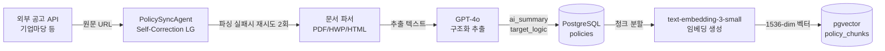
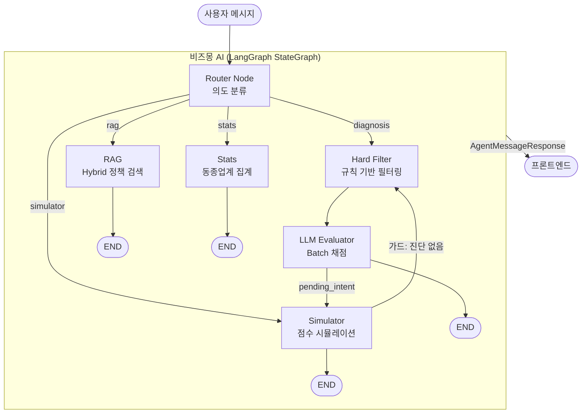

# Biz-Up — 소상공인 경영 합리화 AI 플랫폼

> **"사장님의 정보를 가치로, 정책자금을 성장의 기회로"**  
> 복잡한 행정 용어와 정보 격차를 해소하고, 소상공인의 지속 가능한 성장을 돕는 맞춤형 AI 컨설팅 플랫폼

[](https://www.python.org/)
[](https://fastapi.tiangolo.com/)
[](https://langchain-ai.github.io/langgraph/)
[](https://github.com/pgvector/pgvector)
[](https://openai.com/)

---

## 왜 Biz-Up인가

매년 **20조 원 이상의 정책자금**이 소상공인을 기다리지만, 대부분의 사장님은 복잡한 공고 요건과 정보 비대칭으로 인해 혜택을 받지 못합니다. Biz-Up은 이 문제를 **4가지 핵심 기능**으로 해결합니다.

---

## 핵심 기능 (Key Features)

### 1. 비즈몽 AI 상담 — LangGraph 기반 멀티 에이전트

사장님의 사업장 데이터를 기반으로 **신청 가능한 정책자금을 자동 진단**하고, "특허를 취득하면 점수가 얼마나 오를까?" 같은 가상 시나리오를 시뮬레이션합니다.

비즈몽(BizMong)은 단순 챗봇이 아닙니다. **LangGraph StateGraph** 기반으로 사용자의 의도를 파악하여 4개의 전문 에이전트(진단·시뮬레이션·RAG·통계)가 유기적으로 협력합니다.

| 에이전트 | 트리거 | 동작 |
|:---|:---|:---|
| 진단 (diagnosis) | "어떤 지원금 받을 수 있나요?" | Hard Filter + Batch LLM 채점 → 100점 스코어카드 |
| 시뮬레이션 (simulator) | "특허 취득하면 어떻게 되나요?" | 가상 변수 적용 → 점수 변화 + 이자 절감액 계산 |
| RAG 검색 (rag) | "청년창업패키지가 뭔가요?" | Hybrid RAG (pgvector + FTS + RRF) |
| 동종업계 통계 (stats) | "같은 업종 평균 매출은?" | DB 집계 → 백분위 비교 |

### 2. 비즈-픽 (Biz-Pick) — 맞춤형 정책 카드 뉴스

복잡한 공고문을 사장님 눈높이에 맞게 AI가 재가공한 **큐레이션 카드 뉴스** 피드입니다.

- 매일 신규 정책 공고를 수집하여 **GPT-4o가 3줄 요약** 생성
- 사용자 업종·지역 기반 **개인화 우선순위** 배치
- 공고 본문의 '독소 조항'과 '필수 조건' 하이라이트
- 관심 공고 **북마크** 및 마감 임박 알림 연동

### 3. 통합 대시보드 — 경영 현황 한눈에

- **신청/관심 이력 관리**: 현재 진행 중인 지원 사업의 단계(접수/심사/선정) 트래킹
- **진단 히스토리**: 과거 진단 결과 타임라인으로 경영 지표 변화 추적
- **서류 보관함**: 사업자등록증 등 필수 서류 업로드 → OCR 자동 분석 및 재활용
- **비즈-핑 알림**: 마감 임박, 업력 충족, 신규 맞춤 공고 푸시 알림

### 4. 경영 최적화 시뮬레이션 — ROI 기반 의사결정

- **자금 조달 시뮬레이션**: 고금리 시중 대출을 정책자금으로 대환(Refinancing) 시 **연간 이자 절감액 자동 계산**
- **인프라 도입 ROI**: 서빙 로봇·키오스크 도입 시 인건비 절감 효과와 투자 회수 기간(ROI) 산출
  $$ROI(회수 개월) = \frac{기기\ 도입\ 자부담금}{월간\ 절감\ 인건비 - 월간\ 기기\ 유지비}$$
- **가점 빌드업**: "직원 1명 채용 시", "특허 취득 시" 변화하는 정책자금 합격 확률 시뮬레이션
- **바우처 연계**: 스마트 상점·클라우드 바우처 적용 시 실제 자부담금 계산

---

## AI 핵심 기술 강점

### 비용 최적화 — Batch Chunking으로 LLM 비용 15배 절감

Hard Filter(규칙 기반)를 통과한 정책 후보군을 **10개 단위 청크로 묶어 단일 GPT-4o-mini 호출**로 일괄 채점합니다.

```
50개 정책 채점 시:
  GPT-4o (정책별 1회) : 50회 호출 × $5.00/1M tokens = 비용 기준
  GPT-4o-mini (청크)  :  5회 호출 × $0.15/1M tokens ≈ 15배 절감
```

### 검색 정확도 — pgvector + FTS 기반 Hybrid RAG + RRF

벡터 검색(의미)과 키워드 검색(정확도)을 **Reciprocal Rank Fusion(k=60)**으로 결합하여 두 방식의 장점을 모두 취합니다.

### 시스템 안정성 — Write-through 패턴 + target_logic 파서

- **Write-through**: 각 에이전트 노드 완료 시마다 `ChatLog`에 즉시 기록 → 서버 장애 시에도 데이터 유실 없음
- **target_logic 파서**: GPT가 생성한 비정형 JSONB를 방어적으로 정규화하여 필터 오작동 방지

---

## 비즈몽 에이전트 아키텍처 다이어그램

### 정책 공고 수집 및 임베딩 파이프라인



### 비즈몽 멀티 에이전트 실행 흐름



---

## 기술 스택 (Tech Stack)

| 분류 | 기술 | 역할 |
|:---|:---|:---|
| **Backend** | Python 3.12 + FastAPI | 비동기 API 서버, OpenAPI 자동 문서화 |
| | Pydantic v2 + SQLAlchemy 2.0 | 데이터 검증 + 비동기 ORM |
| | Alembic + uv | DB 마이그레이션 / 고속 패키지 관리 |
| **AI Orchestration** | LangGraph 0.3 | StateGraph + Command 패턴 멀티 에이전트 |
| **LLM** | GPT-4o-mini | 의도 분류 / Batch 채점 / 파라미터 추출 |
| | GPT-4o | 정책 공고 구조화 (PolicySyncAgent) |
| **Embedding** | text-embedding-3-small | 정책 청크 임베딩 (1536-dim) |
| **Database** | PostgreSQL 16 | 정형 데이터 + JSONB(target_logic) |
| | pgvector | 코사인 유사도 벡터 검색 |
| **Frontend** | React 18 + TypeScript | 선언적 UI, 컴포넌트 기반 설계 |
| | Tailwind CSS + React Query | 유틸리티 스타일링 / 서버 상태 관리 |
| **Auth** | JWT Dual Token | Access 30분 + Refresh 7일 |
| **External API** | 국세청 사업자 진위 확인 | 온보딩 자동화 |

---

## 문서 바로가기

| 문서 | 대상 독자 | 핵심 내용 |
|:---|:---|:---|
| [01. 기획 및 요구사항](./docs/01_concept_and_requirements.md) | PM / PO | 5단계 사용자 여정, 비즈니스 페인포인트 |
| [02. 시스템 아키텍처](./docs/02_system_architecture.md) | 백엔드 / LLM 엔지니어 | 전체 시스템 구조, 비즈몽 에이전트 상세 설계 |
| [03. 데이터 설계 명세](./docs/03_data_design_spec.md) | 백엔드 / 프론트 엔지니어 | DB 스키마 전체, API 엔드포인트 목록 |
| [API 명세 (chat)](./docs/api_spec/chat.md) | 프론트엔드 개발자 | 비즈몽 에이전트 응답 JSON 스키마 |
| [API 명세 (business)](./docs/api_spec/business.md) | 프론트엔드 개발자 | 사업장 / 재무 / 서류 CRUD |
| [04. 실험 및 평가](./docs/04_experiment_and_test.md) | 모든 개발자 | RAG 성능 측정, 모델 비교 |
| [05. 트러블슈팅 로그](./docs/05_troubleshooting_log.md) | 모든 개발자 | 주요 이슈 해결 기록 |
| [06. UI/UX 설계서](./docs/06_UI_UX_Dive.md) | 프론트엔드 AI / 디자이너 | 전체 11개 페이지 화면 설계서 |
| [문서 가이드라인](./docs/문서가이드라인.md) | 모든 방문자 | 문서 인덱스 및 읽는 순서 |

---

## 비즈니스 모델

1. **인프라 매칭 수수료 (B2B)**: 시뮬레이션 결과와 연계된 검증된 스마트기기·솔루션 업체 매칭 수수료
2. **B2B 전략 제휴**: 소상공인 대상 세무·법률·마케팅 서비스와의 정보성 연계 및 광고 모델
3. **심화 분석 리포트 (확장)**: AI 진단을 넘어선 정밀 경영 진단 및 심화 리포트 서비스

---

## 개발 기록

비전공자에서 AI 서비스 개발자로 성장하는 과정을 가감 없이 기록하고 있습니다.

[](https://velog.io/@jh-sky/posts)

---

## Changelog

| 버전 | 날짜 | 내용 |
|:---|:---|:---|
| v0.1 | 2026-03-10 | 프로젝트 초기 기획 및 README / 요구사항 정의서 작성 |
| v0.5 | 2026-03-25 | FastAPI 백엔드 기반 구축, 사용자 인증 / 사업장 CRUD 구현 |
| v0.8 | 2026-04-05 | 비즈몽 LangGraph 멀티 에이전트 설계 및 Hard Filter / LLM Evaluator 구현 |
| v0.9 | 2026-04-12 | Hybrid RAG (pgvector + FTS + RRF) 구현, Simulator / Stats 노드 완성 |
| v1.0 | 2026-04-19 | Write-through 패턴 적용, PolicySyncAgent Self-Correction 완성, 문서 전면 개편 |
