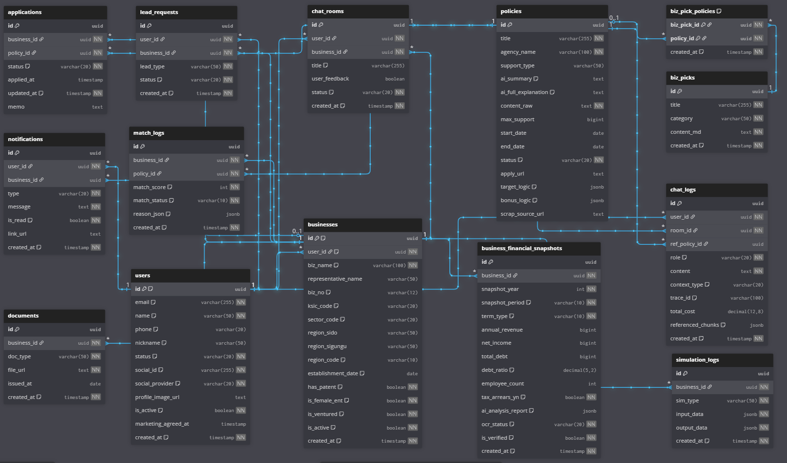

# 🏠 README.md

## 🚀 Biz-Up: 소상공인 경영 합리화 AI 비서
> **"사장님의 정보를 가치로, 정책자금을 성장의 기회로"**
> 복잡한 행정 용어와 정보 격차를 해소하고, 소상공인의 지속 가능한 성장을 돕는 맞춤형 AI 컨설팅 플랫폼입니다.

---

## 🌟 핵심 요약 (Introduction)
정책자금은 매년 수십조 규모로 공급되지만, 대부분의 소상공인은  
복잡한 공고 구조와 불명확한 기준으로 인해 실제 혜택을 받지 못합니다.

Biz-Up은 정책 공고를 구조화하고, 사업자 데이터를 기반으로  
**신청 가능 여부를 정량적으로 판단하고 AI 컨설팅을 제공하는 시스템**입니다.

---

## ✨ 핵심 기능 (Key Features)
### 1. 정책자금 정밀 진단 (Rule-based Matching)
- 정책 조건(`policy_requirements`)과 사업장 데이터(`financial_snapshots`)를 기반으로 매칭 수행
- 결과를 **green / yellow / red 상태값**으로 정량화
- 단순 결과가 아닌 **판정 근거(match_reasons)**를 함께 제공

### 🧠 2. AI 컨설팅 (AI Consultant)
* **전략적 가이드**: 해당 공고가 해당 사업장에 왜 유리한지, 신청 시 주의할 '독소 조항'은 무엇인지 AI가 정밀 분석.
* **합격 팁 제공**: 공고문의 자격 요건을 바탕으로 사장님의 현재- 데이터에서 강조해야 할 강점과 보완점 제안.
* **공고문 핵심 가이드 (Policy Interpreter)**: 수십 페이지의 공고문 중 사장님이 꼭 알아야 할 '독소 조항'과 '필수 조건'만 추출하여 직관적인 요약 리포트 제공.
* **데이터 자동 연동 (AI-Driven Extraction)**: 업로드된 서류에서 매출, 부채, 업력 등 매칭에 필요한 핵심 수치를 AI가 직접 추출하여 입력 번거로움 제거.

### 📊 3. 통합 대시보드 (Smart Dashboard)
* **신청/관심 관리**: 현재 진행 중인 지원 사업의 단계(접수/심사/선정)와 관심 공고를 한눈에 트래킹.
* **개인화 알림**: 저장해둔 공고의 마감 기한이나, 사장님 조건 변화(예: 업력 1년 경과)에 따른 신규 적합 공고 푸시 알림.
* **진단 히스토리**: 과거 진단 기록을 통해 사업장의 재무/경영 지표 변화를 시각화된 그래프로 확인.

### 💡 4. 경영 인프라 최적화 (Cost-Cutting Simulation)
* **대상**: 테이블 오더, 서빙 로봇, 키오스크, 클라우드 POS, AI 무인 보안 시스템 등 현장 맞춤형 기기 매칭.
* **정밀 비용 절감 시뮬레이션**:
    1. **인건비**: 주문/결제 자동화를 통한 피크 타임 고용 대체 효과 산출.
    2. **운영 고정비**: 소모품비, 예약 관리 인력비, 로스율(주문 실수 등) 감소액 반영.
    3. **절세 혜택**: 스마트 기기 도입 시 적용 가능한 세액공제(통합투자세액공제 등) 예상액 계산.
* **정부 바우처 연계**: '스마트 상점', '클라우드 바우처' 적용 시 **실제 자부담금**과 **투자 회수 기간(ROI)** 리포트 제공.

---

### 🛠️ 기술 스택 (Tech Stack)
| 분류 | 사용 기술 (Stack) | 주요 역할 및 강점 (Description) |
| :--- | :--- | :--- |
| **Backend** | **Python 3.11+, FastAPI** | 비동기(`Async/Await`) 처리로 빠른 API 응답 속도 및 서버 성능 확보 |
| | **Pydantic / SQLAlchemy** | 강력한 데이터 타입 검증(`Validation`) 및 안정적인 DB 객체 관계 매핑 |
| **Frontend** | **React 18 / JSX** | 선언적 UI 설계를 통한 가독성 증대 및 현대적 웹 표준 기반 개발 |
| | **JavaScript (ES6+), Vite** | 최신 문법 활용 및 최적화된 빌드 환경 구축으로 개발 효율성 극대화 |
| | **CSS Modules** | 위젯 단위의 독립적 스타일링으로 클래스 네이밍 충돌 방지 및 유지보수 용이 |
| **AI & LLM** | **LangChain / RAG** | 공고문 기반 지식 베이스 구축으로 환각(`Hallucination`) 방지 및 분석 자동화 |
| | **GPT-4o, Claude 3.5 Sonnet** | 시나리오 기반 맞춤형 전략 수립 및 고도화된 AI 컨설팅 로직 수행 |
| **Database** | **PostgreSQL** | 유저 정보, 대시보드 현황, 기기 매칭 데이터의 정교한 관계형 데이터 설계 |
| | **ChromaDB** | 공고 데이터 벡터화를 통한 유사도 기반 맞춤형 정책 매칭 검색 엔진 |
| **기타 (Etc)** | **OAuth 2.0 (Social Login)** | 간편 로그인을 통한 사용자 접근성 향상 및 안전한 본인 인증 체계 |
| | **Selenium, BS4** | 실시간 정책 공고 및 지원금 데이터를 수집하기 위한 자동화 파이프라인 |
---

---
### ✍️ 개발 기록 
본 프로젝트의 **시작점(기획의도)** 및 **개발의 흐름**은 아래 블로그에서 상세히 확인하실 수 있습니다.

비전공자에서 AI 서비스 개발자로 성장하는 과정을 가감 없이 기록하고 있습니다.

---
### 💰 비즈니스 모델 (Revenue Model)
1. **인프라 매칭 수수료 (B2B)**: 시뮬레이션 결과와 연계된 검증된 스마트 기기/솔루션 업체 매칭.
2. **B2B 전략 제휴**: 소상공인 대상 세무, 법률, 마케팅 서비스와의 정보성 연계 및 광고 모델.
3. **심화 분석 리포트 (Future)**: AI 진단을 넘어선 정밀 경영 진단 및 심화 리포트 서비스 (TBD).

### 📂 문서 바로가기 (Documentation)
1. [01_기획 및 요구사항 (concept_and_requirements.md)](./docs/01_concept_and_requirements.md)
2. [02_시스템 아키텍처 (system_architecture.md)](./docs/02_system_architecture.md) 
3. [03_데이터 설계 (data_design_spec.md)](./docs/03_data_design_spec.md) 
4. [04_실험 및 평가 (experiment_and_test.md)](./docs/04_experiment_and_test.md) 
5. [05_트러블슈팅 로그 (troubleshooting_log.md)](./docs/05_troubleshooting_log.md) 

  
🔍 비즈업 서비스 데이터베이스 상세 구조 보기 (클릭)

   
  

    
  

  
  > **설계 핵심 요약**
  > 1. **확장성**: `UUID` 기반 PK 설정을 통해 대규모 데이터 분산 처리에 대비했습니다.
  > 2. **추적성**: `chat_logs`와 `trace_id`를 연결하여 LLM 답변 생성 과정을 모니터링할 수 있도록 설계했습니다.
  > 3. **무결성**: `biz_pick_policies` 중계 테이블을 통해 정책과 콘텐츠 간의 N:M 관계를 해소했습니다.

### 📈 버전 관리 (Changelog)
* v0.1 (2026-03-10): 프로젝트 초기 기획 및 README/요구사항 정의서 작성.