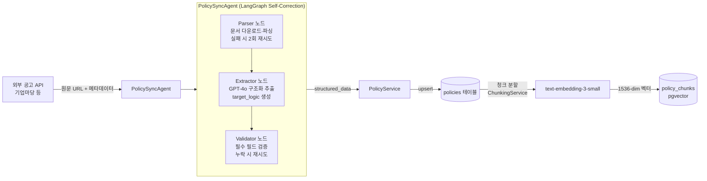

# 02. 시스템 아키텍처

> **서비스명**: Biz-Up / 저장소명: biz-fund-ai / AI 챗봇: 비즈몽(BizMong)
>
> **문서 목적**: 코드를 보지 않고도 전체 시스템 구조와 데이터 파이프라인, 비즈몽 에이전트 흐름을 완벽히 이해할 수 있는 기술 청사진.  
> 특히 LangGraph의 `Command(goto=...)` 라우팅 패턴과 Write-through 내구성 전략을 상세히 기술합니다.
>
> **대상 독자**: 시니어 백엔드 엔지니어, LLM/RAG Engineer

---

## 1. 기술 스택

### Backend

| 분류 | 기술 | 버전 | 역할 |
|:---|:---|:---|:---|
| 언어 | Python | 3.12 | 타입 힌트 + async/await 전체 적용 |
| 웹 프레임워크 | FastAPI | 0.115 | 비동기 API 서버, OpenAPI 자동 문서화 |
| 데이터 검증 | Pydantic v2 | 2.x | 요청/응답 스키마 엄격한 타입 검증 |
| ORM | SQLAlchemy | 2.0 | 비동기 세션(`AsyncSession`) 기반 |
| DB 마이그레이션 | Alembic | - | 스키마 버전 관리 |
| 패키지 관리 | uv | - | pip 대비 10~100배 빠른 의존성 해결 |

### AI / LLM

| 기술 | 모델 | 역할 |
|:---|:---|:---|
| OpenAI | gpt-4o-mini | Router 의도 분류, LLM Evaluator Batch 채점, Simulator 파라미터 추출 |
| OpenAI | gpt-4o | PolicySyncAgent 정책 공고 구조화 |
| OpenAI | text-embedding-3-small | 정책 청크 임베딩 (1536-dim) |
| LangGraph | StateGraph + Command | 멀티 에이전트 오케스트레이션 |

### Database

| 기술 | 역할 |
|:---|:---|
| PostgreSQL 16 | 정형 데이터 (users, businesses, policies 등) + JSONB(target_logic) |
| pgvector 확장 | 벡터 유사도 검색 (policy_chunks.embedding) |

---

## 2. 전체 시스템 아키텍처

### 2.1 High-Level 구조

Biz-Up은 **소상공인 경영 합리화 AI 플랫폼**이며, 비즈몽(BizMong)은 그 안의 AI 상담 기능입니다.

```
[React 프론트엔드 — Biz-Up 서비스]
       │ HTTP/JSON
       ▼
[FastAPI 서버]
  ├── /api/v1/auth          ← JWT 인증 (Access 30분 + Refresh 7일 Dual Token)
  ├── /api/v1/businesses    ← 사업장 + 재무 CRUD + 국세청 API 연동 + OCR
  ├── /api/v1/chats         ← 비즈몽 에이전트 진입점 + 대화 세션 관리
  ├── /api/v1/policies      ← 정책 조회 / 검색 / 북마크 (비즈-픽 연동)
  ├── /api/v1/biz-picks     ← AI 큐레이션 카드 뉴스 (비즈-픽)
  ├── /api/v1/notifications ← 알림 목록 + 설정 (비즈-핑)
  └── /api/v1/admin         ← 관리자 (정책 동기화 트리거)
       │
       ▼
[비즈몽 AI (LangGraph StateGraph)]  ← AI 상담 핵심
       │
       ▼
[PostgreSQL + pgvector]
```

### 2.2 보안 아키텍처

| 구분 | 전략 | 상세 |
|:---|:---|:---|
| 인증 | Dual Token | Access Token(30분, 메모리 저장) + Refresh Token(7일, HttpOnly 쿠키) |
| 권한 관리 | FastAPI Depends | `get_current_user`, `get_active_business` 의존성 주입 |
| 비밀번호 | BCrypt | passlib BCrypt 알고리즘 솔팅 단방향 암호화 |
| 민감 정보 | 환경 변수 | python-dotenv, OPENAI_API_KEY / DATABASE_URL 분리 |
| CORS | FastAPI Middleware | 허용된 프론트엔드 도메인만 수락 |

---

## 3. 비AI 핵심 데이터 플로우

### 3.1 사용자 온보딩 플로우 (국세청 API 연동)

소상공인이 최초 서비스 등록 시 사업자등록번호의 유효성을 국세청 공공 API로 자동 검증합니다. 이 플로우를 통해 허위 정보를 통한 정책자금 오남용을 방지하고, 이후 비즈몽 진단의 정확도를 높입니다.

```
[사용자] 사업자번호 입력
        │
        ▼
[POST /api/v1/onboarding/verify-biz]
        │
        ▼
[BusinessService.verify_biz_no()]
  ├── 국세청 사업자 상태 조회 API 호출
  ├── 반환값: biz_status (계속사업자 / 휴업자 / 폐업자)
  ├── 반환값: tax_type (부가가치세 일반과세자 등)
  └── 반환값: open_date (개업 일자)
        │
        ▼
[DB 저장]
  businesses.is_biz_no_verified = true
  businesses.biz_verified_status = "계속사업자"
  businesses.tax_type = "부가가치세 일반과세자"
  businesses.biz_verified_at = now()
        │
        ▼
[POST /api/v1/onboarding/register]
  → 검증된 사업자 정보 + 사업장 프로필 최초 등록 완료
```

**비즈몽 연계**: `BizMongState.biz_info`에는 `is_biz_no_verified` 필드가 포함됩니다. Hard Filter 노드는 이 값을 참조하여 미검증 사업장의 진단 요청을 안전하게 처리합니다.

---

### 3.2 서류 OCR 처리 플로우

사업자등록증, 재무제표 등 공식 서류를 업로드하면 OCR이 자동 추출하여 `business_financial_snapshots`에 반영합니다.

```
[사용자] 서류 업로드
        │
        ▼
[POST /api/v1/documents]
  ├── 파일 → S3 (또는 스토리지) 저장
  └── documents 테이블 신규 행 생성
      documents.ocr_status = "PENDING"
        │
        ▼
[Background Task: OCR Worker]
  ├── 파일 다운로드
  ├── OCR 엔진 텍스트 추출
  ├── 추출 성공: documents.ocr_status = "COMPLETED"
  │             documents.ocr_result = { 추출된 필드 JSON }
  │             → business_financial_snapshots 자동 갱신 (연매출, 직원 수 등)
  │             → business_financial_snapshots.is_verified = true
  └── 추출 실패: documents.ocr_status = "FAILED"
        │
        ▼
[알림 발송]
  → notifications 테이블 신규 행 (type: "OCR_COMPLETE" / "OCR_FAILED")
  → 비즈-핑(Biz-Ping) 프론트 알림 노출
```

**비즈몽 연계**: OCR로 `is_verified=true`가 된 재무 스냅샷을 사용하면 비즈몽 진단의 신뢰도가 높아지며, AI 요약 리포트에 "공식 서류 검증 완료" 배지가 표시됩니다.

---

## 4. 정책 데이터 파이프라인 — PolicySyncAgent

### 3.1 플로우



### 3.2 Self-Correction 전략

두 단계의 재시도 카운터를 **완전히 분리**하여 서로 간섭하지 않도록 설계했습니다.

| 단계 | 실패 조건 | 재시도 횟수 | 최종 실패 처리 |
|:---|:---|:---|:---|
| Parser 단계 | 파일 다운로드 / 파싱 오류 | 최대 2회 | `status = PARSE_ERROR` |
| Extractor/Validator 단계 | 필수 필드 누락 | 최대 2회 | `status = ANALYSIS_ERROR` |

**Fail-Fast 최적화**: 파일 URL이 없는 경우 파싱 루프를 타지 않고 즉시 실패 처리하여 불필요한 GPT 호출 비용을 차단합니다.

---

## 5. BizMong 멀티 에이전트 — 핵심 설계

### 4.1 State (전역 공유 상태)

LangGraph의 `StateGraph(dict)` 기반으로, 모든 노드가 하나의 State 딕셔너리를 공유합니다.  
`messages` 필드만 `add_messages` reducer로 **추가(append)**되고, 나머지 필드는 **덮어쓰기(shallow-overwrite)**됩니다.

```python
# BizMongState 주요 필드

# 식별자
user_id: str          # 로그인 사용자 UUID
business_id: str      # 사업장 UUID
room_id: str          # ChatRoom.id = LangGraph thread_id

# 데이터 (DB 기반)
biz_info: dict        # Business 모델: 상호명, 지역, 설립일, 특허/벤처 여부 등
financial_data: dict  # BusinessFinancialSnapshot: 매출, 인원, 부채, 체납 여부 등

# 에이전트 작업 공간
current_agent: str              # "diagnosis" | "simulator" | "rag" | "stats"
candidate_policies: list[dict]  # Hard Filter 통과 정책 목록
diagnosis_report: dict          # {score, reason, advice, ranked_policies, ...}
simulation_report: dict         # {original_score, virtual_score, diff, insights, ...}
stats_insight: dict             # {peer_count, avg_revenue, percentile, ...}
rag_results: list[dict]         # [{policy_id, title, rrf_score, relevant_chunk, ...}]

# 제어
pending_intent: str | None      # "simulator" → 진단 완료 후 시뮬레이터 복귀 의도
is_error: bool
error_message: str
```

**thread_id = room_id**: `MemorySaver`가 동일 `room_id`에 대해 여러 요청 간 대화 맥락을 유지합니다. 서버 재시작 시 소멸되며, Write-through ChatLog가 장기 영속성을 담당합니다.

---

### 4.2 그래프 구조 및 라우팅

```
START → router
router → (current_agent) → {hard_filter, simulator, rag, stats}
hard_filter → llm_evaluator
llm_evaluator → (pending_intent) → {simulator, END}
simulator → (guard) → {hard_filter, END}
rag → END
stats → END
```

### 4.3 노드별 상세 설계

#### Node 0: Router Node (의도 분류)

```
입력: messages (대화 히스토리)
출력: current_agent = "diagnosis" | "simulator" | "rag" | "stats"

1차: GPT-4o-mini로 JSON 분류 (max_tokens=20, temperature=0.0)
2차 폴백: 키워드 매칭 (시뮬레이션/변경/대환 → simulator 등)
모호한 경우: diagnosis 기본값
```

---

#### Node 1: Hard Filter Node (규칙 기반 필터링)

LLM 없이 순수 Python 규칙으로 최대 200개 정책을 사전 제거합니다.

**4가지 필터 룰**:

| 룰 | 조건 | 처리 |
|:---|:---|:---|
| R1 (세금 체납) | `tax_arrears_yn = True` | 전 정책 즉시 탈락, diagnosis_report에 체납 사유 기록 |
| R2 (지역 불일치) | `region_restricted=True` AND 사업장 지역 불일치 | 해당 정책 탈락 |
| R3 (업력 미달) | `min_business_age_months > 현재 업력` | 해당 정책 탈락 |
| R4 (규모 초과) | `max_revenue < 연매출` OR `max_employees < 직원수` | 해당 정책 탈락 |

**핵심: `parse_target_logic()` 정규화 파서**

`Policy.target_logic`은 GPT-4o가 생성한 JSONB라 스키마 일관성을 보장할 수 없습니다.  
이 파서가 모든 타입 불일치와 키 누락을 방어적으로 처리합니다.

```python
# 지원하는 금액 표현 형식
"5억"       → 500_000_000
"5억원"     → 500_000_000
"50,000,000" → 50_000_000
50000000    → 50_000_000

# 지원하는 비율 표현 형식
"200%"  → 200.0
200.0   → 200.0

# 지원하는 리스트 표현 형식
"IT,제조"        → ["IT", "제조"]
["IT", "제조"]   → ["IT", "제조"]

# 지원하는 업력 단위 (개월/연 모두 허용)
min_business_age_months: 36  → 36개월
min_business_age_years: 3    → 36개월 (자동 변환)
```

파싱 실패 시 해당 키만 `None`으로 대체하며, 정책은 "통과"로 처리합니다. 필터 전체 무효화를 방지하는 방어 설계입니다.

---

#### Node 2: LLM Evaluator Node (AI 적합도 채점)

**채점 기준 (총 100점)**:

| 카테고리 | 배점 | 세부 기준 |
|:---|:---|:---|
| 기술력 | 40점 | 특허 보유(has_patent=true) +20점, 벤처기업 인증(is_ventured=true) +20점 |
| 고용 | 30점 | 10명 이상 +30, 5~9명 +20, 1~4명 +10, 0명 +0 |
| 안정성 | 30점 | 연매출 10억+ +30, 5억+ +20, 1억+ +10 / 부채비율 200% 초과 시 -10 |

**Batch Chunking 전략**:

```python
CHUNK_SIZE = 10  # 청크당 최대 정책 수
MIN_PASS_SCORE = 40  # 최종 포함 최소 점수

# 50개 정책 처리 시:
# → 5개 청크로 분할
# → 각 청크: 단일 GPT-4o-mini 호출 (response_format=json_object)
# → 청크 실패 시: MIN_PASS_SCORE로 채워 탈락 방지 (장애 허용)
# → 결과 누적 후 점수 기준 내림차순 정렬
```

**`pending_intent` 처리**:
```python
# llm_evaluator 완료 시 pending_intent 확인
if state.get("pending_intent") == "simulator":
    return Command(
        goto="simulator",
        update={**update, "pending_intent": None}  # 의도 소비 후 초기화
    )
```

---

#### Node 3: Simulator Node (가상 시나리오 시뮬레이션)

**Guard Logic — 진단 선행 강제**:

```python
# simulator 진입 시 diagnosis_report 없으면 진단 선행 실행
if not diagnosis_report or not diagnosis_report.get("ranked_policies"):
    return Command(
        goto="hard_filter",
        update={"pending_intent": "simulator"}  # 복귀 의도 저장
    )
# → hard_filter → llm_evaluator 완료 후 pending_intent 감지 → 자동 simulator 복귀
```

**시뮬레이션 파이프라인**:

```
1. 사용자 메시지 → LLM으로 가상 변수 추출 (JSON)
   예: "직원 5명 더 뽑으면?" → {"financial_overrides": {"employee_count": 8}}

2. 가상 상태 구성:
   virtual_biz_info = {**biz_info, **virtual_params["biz_overrides"]}
   virtual_financial = {**financial_data, **virtual_params["financial_overrides"]}

3. 룰 기반 점수 재계산 (LLM 없음, 비용 0원)
   virtual_score = _recalculate_score(virtual_biz_info, virtual_financial)

4. 대환 대출 이자 절감 계산 (loan_params 있을 경우)
   benefit_amount = calculate_finance_benefit(current_rate, target_rate, loan_amount, remaining_months)

5. LLM으로 3가지 인사이트 생성
```

**simulation_report 출력**:
```json
{
  "original_score": 50.0,
  "virtual_score": 70.0,
  "diff": 20.0,
  "virtual_state": {"has_patent": true},
  "benefit_amount": 3200000,
  "insights": [
    "특허 취득 시 기술력 점수가 20점 올라 3개의 신규 정책에 접근 가능해집니다.",
    "현재 신청 가능한 중소기업 R&D 지원 사업의 최소 점수(60점)를 초과하게 됩니다.",
    "벤처기업 인증과 함께 진행하면 추가로 20점이 더 올라 상위 5개 정책 모두 신청 가능합니다."
  ],
  "changed_variables": ["has_patent"]
}
```

---

#### Node 4: RAG Node (Hybrid 정책 검색)

```
Step 1: 쿼리 임베딩 (text-embedding-3-small)
        임베딩 실패 시 FTS 단독으로 폴백

Step 2: 벡터 검색 (pgvector cosine distance)
        PolicyChunk.embedding ↔ query_vector
        지역 필터 선적용 (region_filter)
        상위 20개 policy_id 반환

Step 3: FTS 검색 (ilike 키워드 매칭)
        Policy.title / ai_summary / ai_full_explanation 검색
        최대 5개 키워드 추출, 상위 20개 policy_id 반환

Step 4: RRF 융합 (k=60)
        score(d) = Σ 1 / (60 + rank_i(d))
        top-5 policy_id 선정

Step 5: 정책 상세 조회 + 가장 관련 있는 청크 추출
        → GPT-4o-mini로 답변 생성 (컨텍스트 = 청크 3개)
```

---

#### Node 5: Stats Node (동종업계 집계)

```
1. ksic_code(표준산업분류) 기반 동종 사업장 집계
   - 집계 지표: avg_revenue, avg_employees, avg_debt_ratio
   - 최소 샘플: MIN_PEER_COUNT = 5개
   - 미달 시: 전업종 평균으로 폴백

2. 백분위 간이 계산
   매출 / 평균매출 ≥ 3배 → 상위 10%
   매출 / 평균매출 ≥ 2배 → 상위 25%
   매출 / 평균매출 ≥ 1배 → 상위 50%
   매출 / 평균매출 < 1배 → 하위 25%

3. 인사이트 텍스트 생성 (LLM 없음, 순수 Python 문자열 조합)
```

---

### 4.4 Write-through 내구성 패턴

**문제**: LangGraph의 `MemorySaver`는 메모리 기반이라 서버 재시작 시 소멸됩니다.  
**해결**: 각 terminal 노드 완료 시마다 **별도 DB 세션**으로 `ChatLog`에 중간 결과를 즉시 기록합니다.

```python
async def _write_through(state, node_name, result):
    # 별도 SessionLocal() 사용 → 메인 트랜잭션과 격리
    async with SessionLocal() as wt_session:
        log = ChatLog(
            user_id=user_uuid,
            room_id=room_uuid,
            role="system",
            content=_summarize_result(node_name, result),  # 직렬화 가능한 요약만
            context_type="agent",
        )
        wt_session.add(log)
        await wt_session.commit()
    # 커밋 실패 시 로그만 남기고 에이전트 실행 계속 (에이전트 중단 없음)
```

**각 노드별 Write-through 기록 내용**:

| 노드 | 기록 내용 |
|:---|:---|
| hard_filter | `{node, passed_count}` |
| llm_evaluator | `{node, score, top_policy, total_candidates}` |
| simulator | `{node, original_score, virtual_score, diff}` |
| rag | `{node, results_count}` |
| stats | `{node, peer_count, avg_revenue}` |

---

## 6. API 계층 구조

### 5.1 FastAPI 라우터 구성

```
/api/v1/
├── /auth/          ← 소셜 로그인, 토큰 갱신/로그아웃
├── /users/         ← 사용자 프로필 조회/수정
├── /businesses/    ← 사업장 CRUD + 재무 스냅샷 + 서류
├── /chats/         ← 세션 관리 + BizMong 에이전트 메시지
│   └── /sessions/{id}/agent-message  ← 핵심 에이전트 엔드포인트
├── /policies/      ← 정책 조회/검색/북마크
├── /biz-picks/     ← 큐레이션 카드 뉴스 조회
├── /notifications/ ← 알림 목록/설정
└── /admin/         ← 정책 동기화 트리거 (관리자 전용)
```

### 5.2 AgentMessageResponse — 핵심 응답 스키마

`POST /api/v1/chats/sessions/{session_id}/agent-message` 의 응답:

```json
{
  "status": 200,
  "data": {
    "session_id": "uuid",
    "message_id": "uuid",
    "role": "assistant",
    "content": "진단 완료! 현재 프로필 적합도 점수: 65.0점\n추천 정책: 소상공인 경영안정자금 (총 12개 매칭)\n...",
    "agent_type": "diagnosis",
    "diagnosis_report": {
      "score": 65.0,
      "top_policy": "소상공인 경영안정자금",
      "top_score": 80,
      "reason": "매출 규모와 고용 인원이 정책 기준을 충족합니다.",
      "advice": "벤처 인증이나 특허 취득 시 더 많은 기회가 생깁니다.",
      "ranked_policies": [...],
      "total_candidates": 12
    },
    "simulation_report": null,
    "stats_insight": null,
    "rag_results": null,
    "created_at": "2026-04-19T12:00:00Z"
  }
}
```

---

## 7. 인프라 및 운영 환경

| 항목 | 기술/전략 |
|:---|:---|
| 버전 관리 | Git + GitHub (Feature Branch 전략) |
| 패키지 관리 | uv (Python), npm (JavaScript) |
| 로깅 | Python logging 모듈 (각 노드마다 INFO/DEBUG 레벨 분리) |
| DB 마이그레이션 | Alembic (versions/ 하위 파일로 이력 관리) |
| 환경 변수 | python-dotenv (.env 분리, .gitignore 처리) |
| 에디터 | Visual Studio Code (Cursor IDE) |
