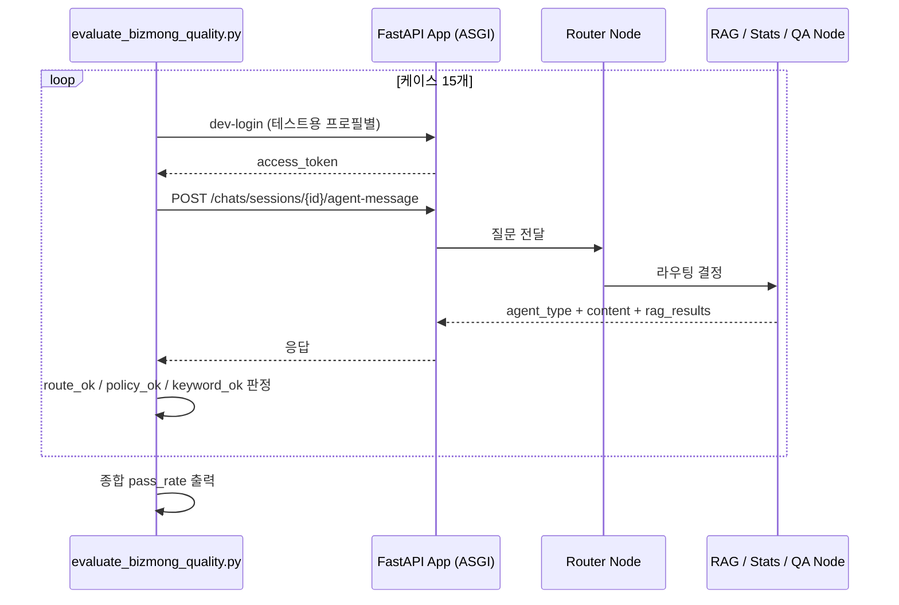

# 실험 및 검증 기록

> `biz-fund-ai/backend/src/app/`  
> 작성: 이종혁 · 2026

---

## 개요

이 문서는 포트폴리오에서 수치로 제시한 두 가지 주요 실험의 설계·과정·결과를 기록한다.

| # | 실험 | 핵심 수치 | 관련 파일 |
|---|------|-----------|-----------|
| 1 | BizMong 품질 검증 하네스 | 최종 15/15 통과 (100%) | `scripts/evaluate_bizmong_quality.py` |
| 2 | 비용 최적화 — 모델 분리 및 작업 복잡도 기반 선택 | 약 15배 절감 | `agents/policy_sync_agent.py`, `agents/biz_mong/` |

---

## 실험 1 — BizMong 품질 검증 하네스

### 1-1. 문제 인식 — "이게 잘 작동하는지 어떻게 알아?"

Hybrid RAG 파이프라인을 구축하고 Router 노드를 붙인 뒤, 처음에는 직접 질문을 입력해 결과를 눈으로 확인했다.

```
"내가 받을 수 있는 정책자금 뭐야?" → 결과 확인 → "맞는 것 같은데?"
```

이 방식엔 두 가지 문제가 있었다.

**① 기준이 없다**  
"잘 됐다"는 느낌이지, 수치가 아니다. 프롬프트를 수정하거나 RAG 파라미터를 바꿨을 때 이전보다 나아진 건지 나빠진 건지 알 수 없다.

**② 범위가 좁다**  
내가 테스트하는 질문만 확인된다. 정책 질문을 잘 처리하더라도, 통계 질문이 엉뚱한 노드로 가거나 용어 설명 질문이 RAG를 돌리는 문제를 놓칠 수 있다.

비용 최적화(실험 2) 이후 이 문제가 더 분명해졌다. **"비용은 줄었는데, 품질은 그대로인지 어떻게 확인하지?"**

### 1-2. 설계 방향 — 무엇을 측정할 것인가

#### 케이스 설계 원칙

단순히 "정답이 나오는가"로만 평가하면 부족하다고 판단했다.

| 질문 유형 | 예시 | 어려운 이유 |
|-----------|------|------------|
| 직접 표현 | "정책자금 추천해줘" | 기본 케이스 |
| 우회 표현 | "가스비 전기세가 너무 올라서 팍팍하네" | 의도 추론 필요 |
| 지역+업종 복합 | "강원도 관광업 지원 있어?" | 필터 2개 동시 |
| 리스크 질문 | "세금 체납이 있으면 신청 어려워?" | 정책 특정 없이 안내 |
| 복합 목적 | "고용 지원이랑 운전자금 각각 추천해줘" | 두 정책 동시 |
| 라우팅 구분 | "동종업계 매출 비교해줘" | stats로 가야 함 |
| 용어 해석 | "운전자금이 뭐야?" | general_qa로 가야 함 |

#### 평가 축 3개

```python
passed = route_ok AND policy_ok AND keyword_ok
```

| 축 | 의미 | 이유 |
|----|------|------|
| `route_ok` | 라우터가 올바른 노드를 선택했는가 | RAG로 가야 할 걸 stats로 보내면 근본적으로 틀림 |
| `policy_ok` | 예상 정책이 RAG 결과에 포함됐는가 | 라우팅은 맞아도 엉뚱한 정책을 꺼낼 수 있음 |
| `keyword_ok` | 응답에 핵심 키워드가 포함됐는가 | 정책은 맞아도 설명이 엉뚱한 방향일 수 있음 |

셋 중 하나라도 틀리면 실패로 판정한다.

### 1-3. 테스트 케이스 15개

```
초기 12케이스에서 10/12 통과(83.3%)를 확인한 뒤,
실패 패턴이었던 우회 표현·복합 목적 질문을 보완하기 위해 3개 케이스를 추가했다.

최종 15케이스 · rag 13개 / stats 1개 / general_qa 1개
평가 데이터: 테스트용 사업자 프로필 7종(BIZ-01 ~ BIZ-07)에 대표 상담 질문 15건 배분
```

| # | 시나리오 | 질문 요약 | 예상 라우팅 | 핵심 검증 포인트 |
|---|----------|-----------|------------|----------------|
| 1 | BIZ-01 | 받을 수 있는 정책자금 뭐야? | rag | 기본 추천 |
| 2 | BIZ-01 | 서울 초기창업 자금 왜 추천돼? | rag | 근거 설명형 |
| 3 | BIZ-01 | 가스비 전기세 너무 올라서 팍팍 | rag | **우회 표현 — 의도 추론** |
| 4 | BIZ-02 | 설비 바꾸려는데 제조업 시설자금 | rag | 업종 특화 |
| 5 | BIZ-03 | 여성기업 부산 지원사업 | rag | 지역+업종 복합 |
| 6 | BIZ-04 | 벤처·특허 IT 기술창업 지원 | rag | 자격요건 복합 |
| 7 | BIZ-05 | 강원도 관광업 살려주는 거 | rag | 지역+업종 복합 |
| 8 | BIZ-06 | 재무 상태 안 좋아도 운영자금 | rag | 조건 불리한 케이스 |
| 9 | BIZ-07 | 세금 체납 있으면 신청 어려워? | rag | 리스크 안내 (정책 특정 없음) |
| 10 | BIZ-01 | 고용 지원이랑 보증금 대출 각각 추천 | rag | **복합 목적 — 두 정책 동시** |
| 11 | BIZ-01 | 동종업계 평균 매출 비교 | **stats** | 라우팅 구분 검증 |
| 12 | BIZ-01 | 운전자금이 뭐야? 시설자금이랑 어떻게 달라? | **general_qa** | 라우팅 구분 검증 |
| 13 | BIZ-01 | 월급 지원과 임대료 부담을 같이 줄일 지원 | rag | **생활어 기반 복합 의도** |
| 14 | BIZ-02 | 공장 설비 교체를 지원하는 제조업 자금 | rag | 제조업 설비 교체 자연어 질문 |
| 15 | BIZ-05 | 강원 관광업 회복 쪽으로 바로 쓸 지원 | rag | 지역+업종 자연어 확장 질문 |

케이스 3(우회 표현), 케이스 10(복합 목적), 케이스 13(생활어 기반 복합 의도)이 핵심 난이도 케이스다.

### 1-4. 실행 구조



실제 서버를 띄우지 않고 `httpx.ASGITransport`로 앱을 직접 호출한다.  
테스트용 사업자 프로필(BIZ-01 ~ BIZ-07)별로 `dev-login`을 수행해 업종·지역·재무 상태가 다른 사업자 컨텍스트를 주입한다.

평가 리포트는 단순 통과율만 출력하지 않고 `route_accuracy`, `policy_accuracy`, `keyword_accuracy`, `fallback_count`, `fallback_rate`, 평균 응답시간, p95 응답시간까지 함께 집계한다.  
그래서 "정답을 맞혔는가"뿐 아니라 "폴백에 기대지 않고 안정적으로 답했는가", "응답 지연이 과도하지 않았는가"도 같은 하네스에서 확인할 수 있다.

### 1-5. 결과

```
초기 결과: 10 / 12 통과 (83.3%)
보완 후 최종 결과: 15 / 15 통과 (100%)
```

초기 미통과 2케이스의 공통 패턴은 **표현 편차가 큰 케이스**였다.  
우회 표현이나 복합 목적 질문처럼 의도 추론이 필요한 경우, RAG 검색은 정상 동작했지만 응답의 키워드 구성이 예상과 달랐다.

이를 해결하기 위해 다음 로직을 보완했다.

| 보완 지점 | 적용 내용 | 해결한 문제 |
|-----------|-----------|-------------|
| Query Rewriting | 우회 표현을 `운영자금`, `고용지원`, `시설자금` 같은 검색 친화 키워드로 재작성 | "가스비가 팍팍하다" 같은 생활어 질문의 정책 검색 누락 |
| Multi-intent Search Plan | `각각`, `하나씩`, `두 가지` 표현을 감지해 의도별 검색 태스크 분리 | 고용지원과 운전자금처럼 한 질문에 여러 목적이 섞인 경우 |
| Sectioned Answer | 복합 질문이면 의도별 섹션으로 답변하도록 프롬프트와 fallback 답변 보강 | 검색은 됐지만 답변에서 기대 키워드가 빠지는 문제 |

이 결과가 Hybrid RAG(pgvector + BM25 + RRF)의 설계 방향을 검증해줬다.  
단일 벡터 검색만으로는 우회 표현 케이스에서 정책 누락이 발생했을 가능성이 높다.

### 1-6. 이 하네스가 해준 것

비용 최적화(실험 2) 이후 품질이 유지되는지 확인할 수 있었다.  
프롬프트나 검색 로직을 수정할 때마다 같은 평가셋을 다시 돌려 회귀 여부를 체크했다.

**"잘 되는 것 같다"가 아니라 "초기 83.3%에서 실패 유형을 분리했고, 테스트용 사업자 프로필 7종에 배분한 대표 상담 질문 15건을 복합 의도 보완 후 모두 통과했다"로 말할 수 있게 됐다.**

---

## 실험 2 — 비용 최적화 실험

### 2-1. 문제 인식

초기 설계에서는 BizMong 에이전트의 모든 노드가 동일하게 gpt-4o를 사용하고 있었다.

**문제가 된 지점:**
- Router 노드: 의도 4개 중 하나를 고르는 단순 분류에 gpt-4o 사용
- Greeting 노드: "안녕하세요" 인사 응답에도 매번 GPT 호출
- RAG 답변 생성: 검색 결과를 정리하는 작업에 고성능 모델 불필요

"모든 노드에 같은 모델을 쓴다"는 것은 비용 기준이 없다는 뜻이다.  
각 노드가 실제로 요구하는 복잡도를 따져보지 않은 초기 설계였다.

### 2-2. 핵심: 작업 복잡도에 따른 모델 분리

각 노드가 실제로 무엇을 하는지 분석한 뒤 모델을 재배정했다.

| 노드/작업 | 이전 | 이후 | 판단 근거 |
|-----------|------|------|-----------|
| Router (의도 분류) | gpt-4o | **gpt-4o-mini** max_tokens=20 | 4개 레이블 중 택1, 분류 이상의 추론 불필요 |
| Chitchat greeting | gpt-4o | **정적 문자열** | 응답이 항상 동일 → LLM 호출 자체가 낭비 |
| Chitchat general_qa | gpt-4o | **gpt-4o-mini** | 용어 설명·일반 답변, 고성능 모델 불필요 |
| RAG 답변 생성 | gpt-4o | **gpt-4o-mini** | 검색된 청크를 정리하는 작업, 창의적 추론 불필요 |
| PolicySync 구조화 | gpt-4o | **gpt-4o 유지** | 비정형 공고문 → JSON 필드 추출, 정확도가 비용보다 우선 |

**판단 원칙**: 모델을 낮추는 기준은 "싸서"가 아니라 "이 작업이 고성능 추론을 필요로 하는가"였다.  
PolicySync 구조화는 복잡한 JSON 추출이 실패하면 데이터 파이프라인 전체가 오염되기 때문에 gpt-4o를 유지했다.

### 2-3. 비용 계산 근거

```python
# telemetry.py 코드 기준 단가
MODEL_PRICING_USD_PER_1K = {
    "gpt-4o-mini": (0.00015, 0.0006),   # (input, output)
    "gpt-4o":      (0.005,   0.015),
}
```

| 구분 | gpt-4o | gpt-4o-mini | 단가 비율 |
|------|--------|-------------|-----------|
| 입력 토큰 | $0.005/1K | $0.00015/1K | **33x** |
| 출력 토큰 | $0.015/1K | $0.0006/1K  | **25x** |

채팅 1회 기준 (router + RAG 답변 생성):

| 항목 | 이전 | 이후 |
|------|------|------|
| Router | gpt-4o | gpt-4o-mini |
| Greeting | GPT 호출 | 정적 문자열 (0원) |
| RAG 답변 | gpt-4o | gpt-4o-mini |
| **비용 비율** | 기준 | **약 1/15** |

"약 15배"는 단가 비율(25~33x)에서 gpt-4o를 유지한 PolicySync 비중을 반영한 보수적 수치다.

> **임베딩 배치 처리**: 임베딩 API 호출은 별도로 20건 단위 배치로 처리한다 (`_OPENAI_BATCH_SIZE = 20`). 임베딩 특성상 여러 텍스트를 한 번에 보낼 수 있어 API 호출 횟수를 줄이는 기본 조치다.

### 2-4. 회귀 방지

모델을 바꾼 뒤 가장 먼저 한 것은 **실험 1(평가 하네스) 재실행**이었다.  
비용을 줄였어도 품질이 떨어졌다면 의미 없기 때문이다.

```
모델 최적화 직후: 83.3% (10/12) → 품질 유지
복합 의도/우회 표현 보완 후: 100% (15/15) → 대표 상담 질문 15건 전부 통과
```

"비용을 줄였다"가 아니라 **"모델 경량화 후에도 품질을 유지했고, 이후 실패 케이스를 평가셋에 추가해 복합 의도 질문까지 15/15로 검증했다"** 로 말할 수 있게 됐다.
