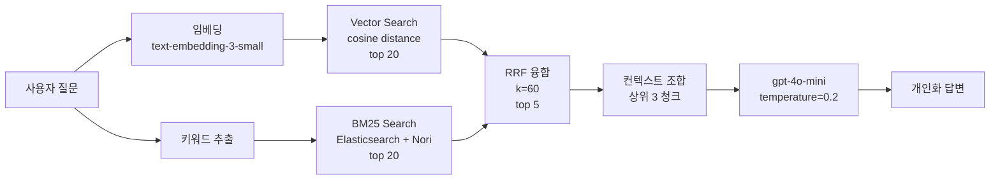
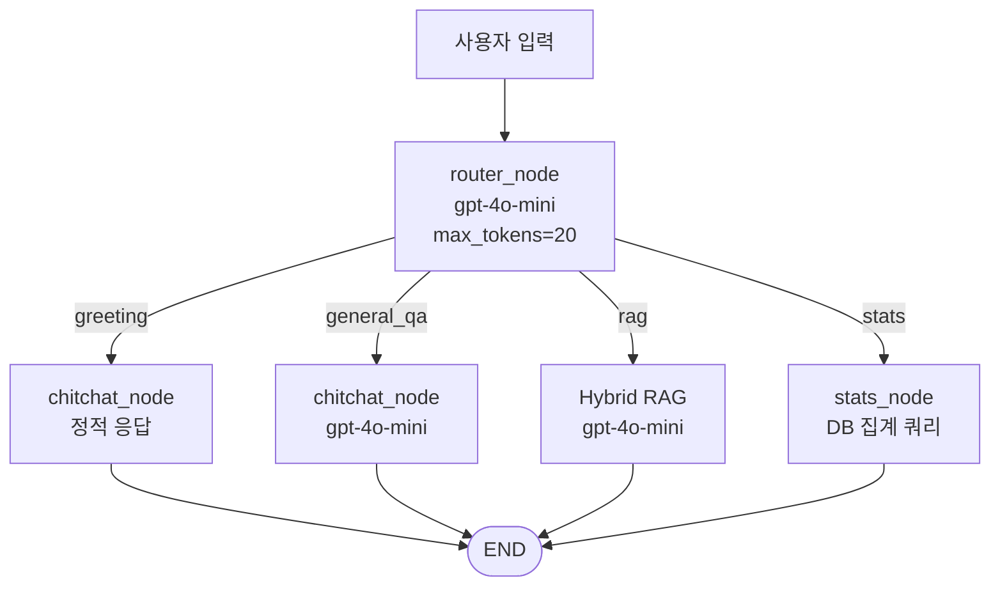
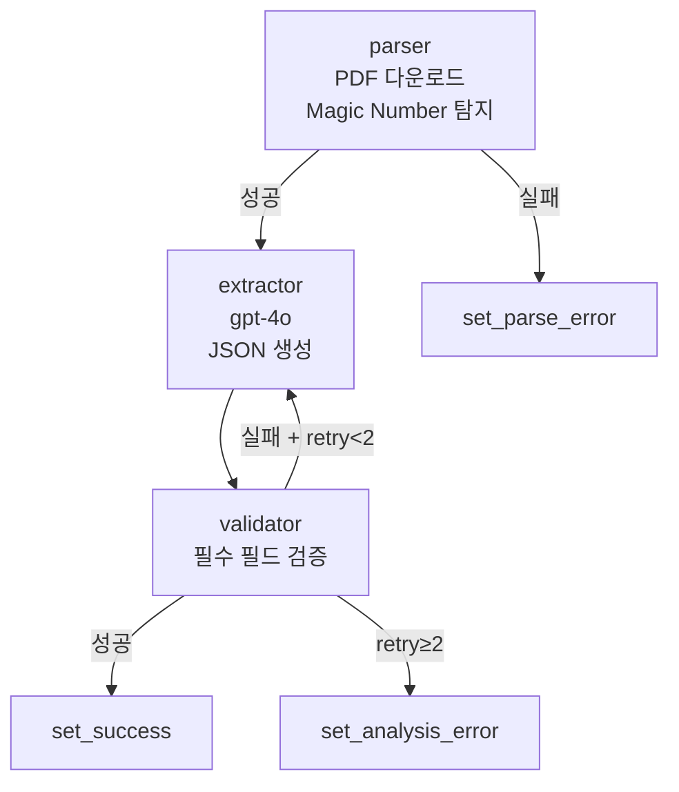

# RAG 파이프라인 설계 근거 문서

> `biz-fund-ai/backend/src/app/agents/biz_mong/`  
> 작성: 이종혁 · 2026-05

---

## 왜 이 문서를 쓰는가

포트폴리오에서 "Hybrid RAG 구조는 문제를 풀기 위해 필요한 선택이었습니다"라고 주장했다.  
이 문서는 그 선택 하나하나에 이유가 있었음을 코드 수준에서 증명한다.

---

## 1. 문제 정의 — 왜 단일 검색으로는 안 됐나

정책자금 질문은 두 가지 이유로 단일 검색에 취약하다.

**표현 편차 문제**  
"창업 지원금 알려줘"와 "초기창업패키지 신청하려면?"은 의미는 같지만 표현이 전혀 다르다.  
Vector Search는 의미적으로 비슷한 문서를 잡지만 고유명사(정책명)를 정확히 매칭하지 못한다.  
Keyword Search는 고유명사에 강하지만 의미 편차에 취약하다.

**정책 문서 구조 문제**  
정책 공고문은 "지원대상", "신청방법", "지원한도" 같은 섹션이 명확히 나뉜다.  
청크 경계가 섹션 경계와 맞지 않으면 한 청크에 "신청방법"과 "지원금액"이 섞여 검색 정밀도가 떨어진다.

---

## 2. Hybrid RAG 설계

### 2-1. 전체 흐름



### 2-2. 각 단계 설계 결정

**Vector Search — top 20, cosine distance**

```python
_VECTOR_LIMIT = 20   # 벡터 후보 수
```

policy_id별로 청크 중 최소 cosine distance를 대표값으로 사용한다.  
청크 수준이 아닌 **정책 수준**으로 먼저 집계해 중복 정책이 결과를 독점하는 것을 막는다.

**BM25 Search — Elasticsearch + Nori 기반 sparse retrieval**

```python
_FTS_LIMIT = 20
# Elasticsearch multi_match 대상 필드
title^4 / agency_name^3 / content^1
```

정책명·기관명처럼 정확히 맞아야 하는 질의를 위해 BM25를 사용했다.  
한국어 복합어·정책명 검색 누락을 줄이기 위해 Nori 분석기를 적용했고,  
제목·기관명·본문에 서로 다른 가중치를 두어 sparse retrieval 점수를 구성했다.

**RRF 융합 — k=60**

```
score(d) = Σ 1 / (k + rank_i(d))
```

k=60은 Cormack et al.(2009) 논문에서 검증된 표준값이다.  
두 검색 결과를 rank 기준으로 융합해 어느 한쪽에 편중되지 않도록 한다.  
**최종 반환: top 5 정책, 답변 생성에는 상위 3 청크만 사용.**

**임베딩 실패 폴백**

OpenAI 임베딩 API 실패 시 `query_vector = None`으로 자동 처리,  
Elasticsearch 비활성화 또는 검색 실패 시 PostgreSQL `ilike` 검색으로 fallback해 서비스 중단 없이 결과를 반환한다.

### 2-3. Query Rewriting과 복합 의도 검색

초기 평가 하네스에서 실패한 케이스는 단순 검색 실패가 아니라 **사용자 표현과 정책 검색어 사이의 간극**이었다.

| 실패 유형 | 사용자 질문 예시 | 보완 로직 |
|-----------|------------------|-----------|
| 우회 표현 | "가스비 전기세가 너무 올라서 팍팍하네" | 생활어를 `운영자금`, `경영안정자금` 같은 검색 질의로 재작성 |
| 복합 목적 | "고용 지원이랑 보증금 대출 각각 추천해줘" | 고용지원/운영자금 의도로 나누어 별도 검색 태스크 생성 |
| 자연어 확장 | "공장 설비를 바꾸고 싶은데 지원 있어?" | 제조업·시설자금·설비 교체 키워드로 검색어 확장 |

현재 `policy_rag.py`는 질문에서 의도를 먼저 감지하고, 의도별 `SearchTask`를 만든다.

```python
SearchTask(
    intent_name="hiring",
    rewritten_queries=["고용지원금", "인건비 지원", ...],
    expected_support_types=["고용지원", "인건비", ...],
)
```

각 태스크는 LLM 기반 query rewriting을 먼저 시도하고, 실패하면 규칙 기반 폴백으로 검색어를 만든다.  
검색 결과는 의도별로 모은 뒤 다시 병합하며, `multi_intent_mode=True`이면 답변 생성 단계에서 의도별 섹션 분리를 강제한다.

이 보완 이후 평가셋을 기존 12개에서 15개로 확장했고, 테스트용 사업자 프로필 7종에 우회 표현·복합 의도·자연어 확장 질문을 배분해 15/15 통과 기준으로 검증했다.

### 2-4. 사업자 컨텍스트 기반 개인화 재랭킹

RAG 검색은 질문 텍스트만으로 끝내지 않고 사업자 컨텍스트를 후보 점수에 반영한다. `policy_rag_search()`는 `biz_info`를 받아 지역, 업종, 자금 목적, 초기창업 여부, 벤처·특허 보유 여부를 재랭킹 단계에 사용한다.

| 컨텍스트 | 반영 방식 | 목적 |
|----------|-----------|------|
| 지역 | 지역 제한 정책이면 사업장 `region_sido`와 맞을 때 가점, 불일치 시 감점 | 전국 정책과 지역 한정 정책을 구분 |
| 업종/KSIC | 정책 `target_logic.sectors`와 사업장 업종 토큰 비교 | 업종 특화 정책 우선 노출 |
| 자금 목적 | `funding_purpose`가 운영/운전/복합이면 관련 지원 유형 가점 | 사용자가 원하는 자금 용도와 검색 결과 정렬 |
| 초기창업 | 설립 36개월 이내면 초기창업/창업자금 키워드 가점 | 업력 조건이 맞는 공고 우선 |
| 자격 조건 | 벤처·특허 필수 정책인데 사업장이 해당 조건을 갖추지 못하면 감점 | 부적합 정책 상위 노출 방지 |

즉, 같은 "받을 수 있는 정책자금 추천" 질문이라도 서울 초기창업 사업자, 강원 관광업 사업자, 제조업 설비 교체 사업자에게 서로 다른 후보가 먼저 올라오도록 설계했다.

---

## 3. 청킹 전략 — RecursiveCharacterTextSplitter를 안 쓴 이유

LangChain의 범용 텍스트 분할기 대신 **2단계 직접 구현**을 선택했다.

### 3-1. 설계

```
정책 공고 원문
    ↓
[섹션 헤더 탐지]
헤더 2개 이상 → 섹션 경계로 분할 (최대 2,000자)
헤더 부족     → 슬라이딩 윈도우 (800자, 오버랩 100자)
    ↓
최소 50자 미만 청크 제거 (노이즈)
```

| 파라미터 | 값 | 이유 |
|---------|-----|------|
| 섹션 최대 | 2,000자 | 섹션 초과 시 슬라이딩 윈도우로 재분할 |
| 윈도우 크기 | 800자 | 한국어 기준 임베딩 품질과 컨텍스트 보존 균형 |
| 오버랩 | 100자 | 청크 경계 문장 절단 방지 |
| 최소 크기 | 50자 | 헤더만 있는 빈 청크 제거 |

**왜 섹션 분할을 우선하는가**  
정책 공고문은 "지원대상", "신청방법", "지원한도" 같은 고정 섹션 구조를 갖는다.  
섹션 경계를 청크 경계로 맞추면 검색 시 "신청방법이 뭐야?"라는 질문에  
지원금액 내용이 섞이지 않은 정확한 섹션이 반환된다.

### 3-2. Contextual Embedding

OpenAI에 전송하는 텍스트에만 정책 메타 prefix를 붙인다.

```python
# 저장: 원본 그대로
chunk_text = "만 39세 이하 청년 창업자에 한하며..."

# 임베딩 전송용
embed_text = f"[정책명: 청년창업사관학교]\n[기관: 중소벤처기업부]\n{chunk_text}"
```

Anthropic "Contextual Retrieval" 기법을 적용해 청크 단독으로는 알 수 없는  
정책명·기관 맥락을 임베딩 공간에 반영한다.  
저장은 원본 그대로 유지해 중복 저장 없이 처리한다.

---

## 4. 노드 분리 — 왜 하나의 LLM에 몰아주지 않았나

### 4-1. 분기 구조



### 4-2. 노드 분리의 이유

**추적 가능성**  
모든 처리를 하나의 LLM에 맡기면 "왜 이 답변이 나왔냐"를 역추적할 수 없다.  
노드별로 입력·출력을 분리하면 어느 단계에서 문제가 생겼는지 LangSmith로 정확히 추적 가능하다.

**비용 최적화**  
| 노드 | 모델 | 이유 |
|------|------|------|
| router | gpt-4o-mini, max_tokens=20 | intent 4개 분류만 하면 됨 |
| chitchat greeting | 정적 문자열 | LLM 호출 0원 |
| chitchat general_qa | gpt-4o-mini, max_tokens=450 | 일반 답변, 길이 제한 |
| RAG 답변 | gpt-4o-mini, temperature=0.2 | 검색 결과 기반이라 강력한 모델 불필요 |
| policy 구조화 추출 | gpt-4o | 복잡한 JSON 추출 — 정확도 필수 |

**Router 2단계 폴백**  
```
1차: gpt-4o-mini JSON mode (LLM 분류)
2차: 키워드 매칭 _classify_by_keyword() (LLM 실패 시)
```
LLM 호출 실패 시에도 서비스가 끊기지 않는다.

---

## 5. 정책 동기화 — Self-Correction 루프

단순 추출이 아닌 **검증 후 재시도** 구조로 데이터 품질을 보장한다.



**필수 검증 필드**: `ai_summary`, `target_logic`, `support_amount`, `dates`  
**재시도 분리**: parse 실패와 extract 실패를 별도 카운터로 관리해 불필요한 재파싱을 막는다.

**Magic Number 탐지**  
확장자가 `.pdf`여도 실제 파일은 HWP인 경우가 있다.  
파일 헤더 바이트를 읽어 실제 형식을 판단한 뒤 파서를 분기한다.

---

## 6. pgvector 선택 이유

| 선택지 | 비용 | 인프라 |
|--------|------|--------|
| Pinecone / Weaviate | 별도 요금 발생 | 관리 포인트 추가 |
| **pgvector (선택)** | PostgreSQL 확장, 추가 비용 없음 | 단일 DB |

현재 수백만 건 이내에서는 Exact Search로 충분히 실용적이다.  
데이터가 충분히 쌓이면 IVFFlat 인덱스를 별도 마이그레이션으로 추가하는 계획으로 설계했다.

```python
# model.py
embedding: Mapped[Optional[list[float]]] = mapped_column(
    Vector(1536),   # text-embedding-3-small 기본 차원
    nullable=True,
)
```

임베딩 재계산 최적화: 공고 원문의 SHA-256 해시를 비교해  
동일 내용이면 임베딩을 건너뛰어 OpenAI 비용과 DB I/O를 줄인다.

---

## 7. 설계 결정 요약

| 결정 | 선택 | 이유 |
|------|------|------|
| 검색 방식 | Vector + BM25 + RRF | 표현 편차에 강하면서 정책명·기관명도 잡음 |
| Query Rewriting | LLM 재작성 + 규칙 기반 폴백 | 생활어 질문을 검색 가능한 정책 키워드로 변환 |
| 복합 의도 처리 | 의도별 SearchTask + 섹션형 답변 | 한 질문에 여러 목적이 섞여도 각각 검색·설명 |
| 청킹 | 섹션 분할 우선, 슬라이딩 윈도우 폴백 | 정책 문서 구조에 맞는 경계 보존 |
| Contextual Embedding | prefix 붙여 임베딩 | 청크 단독으로는 맥락 소실 방지 |
| 노드 분리 | Router → 4개 노드 | 추적 가능성 + 비용 분리 |
| LLM 모델 선택 | gpt-4o-mini / gpt-4o 혼용 | 복잡도에 맞게 모델 분기 |
| Vector DB | pgvector (PostgreSQL 내) | 인프라 단순화, 현 규모에 충분 |
| 임베딩 재계산 | SHA-256 해시 비교 | 동일 공고 재처리 비용 0 |
